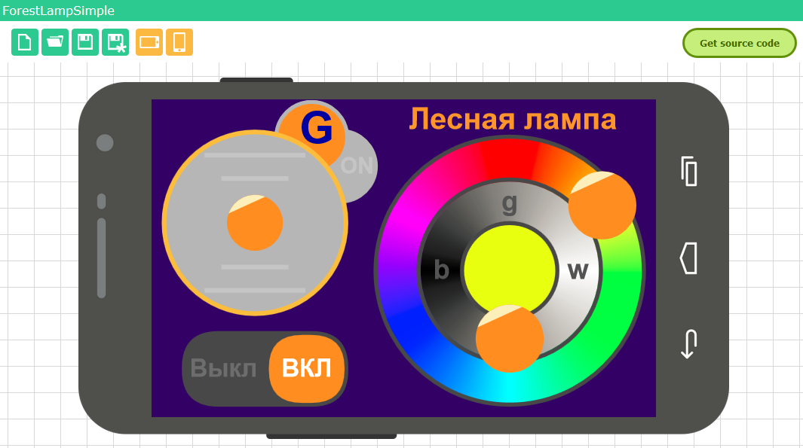

# Forest Lamp

Electronic and firmware for that lamp is based on [AlexGyver LED Lamp](https://github.com/AlexGyver/GyverLamp).
The lamp itself is 3D printed as 75% more resized version of that ["resized" model](https://www.thingiverse.com/thing:2657068), which is the remix from original [Forest Lamp](https://www.thingiverse.com/thing:1491062). 
ESP8266 board (I used WeMos D1 mini) runs modified AlexGyver's firmware, where I made some configuration changes, tweaks for stability and flickering removal.
Also I added additional features which are controlled via RemoteXY Android app.

## 3D model changes

I made few additional models and did not use light core. 

* LED core for 8 WS2812 LED stripes with 5 LEDs each (it is low density stripe, stripe with higher number of LEDs is preferable);
* Top cap for the LED core to make it attachable with bolt and nut to the lamp walls and roof;
* Bottom cap to cover gaps between lamp walls and base;
* Crystal-like nut to attach lamp case to the top cap and LED core.

The idea is to disassemble the lamp with only 1 nut.

## Additional features exposed via RemoteXY app

* Simplified color selection, brightness control and grayscale;
* Alternative on/off switch;
* Special control for focusing lamp beam (a la "radar");
* Russian language interface;

## Parts

* WeMos D1 min;
* 40 WS2812 LEDs on the stripe, cut to 8 pieces by 5 LEDs each.
* 10k resistor pull-up from RST pin to 3.3V;
* 0.1uF ceramic capacitor between 3.3V pin to GND pin (in fact, to the closest pin of RESET button, which is connected to GND);

The last 2 items should decrease chance of freezing ESP8266 on power-up.

## Libraries

* [Modifed version](libraries/RemoteXYap) of [RemoteXY](http://remotexy.com) library where I removed code that creates connection and configures WiFi module (because AlegGyver firmware already does it in a better way).
The library should be placed into library folder as usual.
* All libraries required by AlexGyver's lamp (FastLED etc.).

Note: I also considered using Virtuino, but amazing RGB control and joystick control in RemoteXY forced me to choose RemoteXY.

## RemoteXY UI

RemoteXY UI should be available by [link](http://remotexy.com/en/editor/b432a2957787b45cd5d483b4a82bf226/). 
It works even in free version of RemoteXY Android app, because contains less than 5 controls.

## Models
Please see them in [models folder](models). 

## Building photos
Please see them in [docs folder](docs). 

## TODO
* Add more photos
* Add videos
* Add 3D models to Thingiverse;
* Re-enable WDT;
